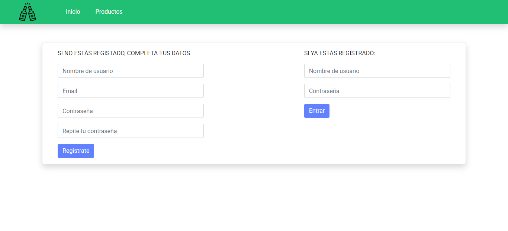
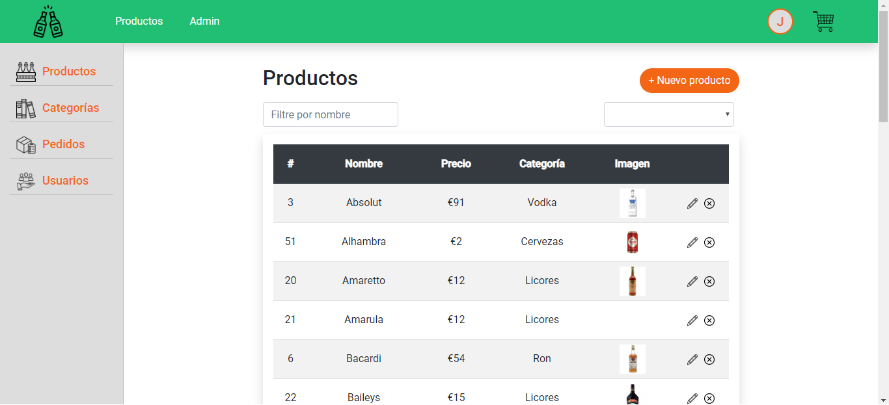
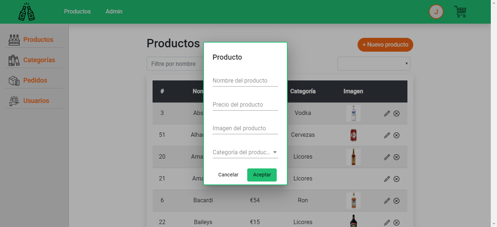
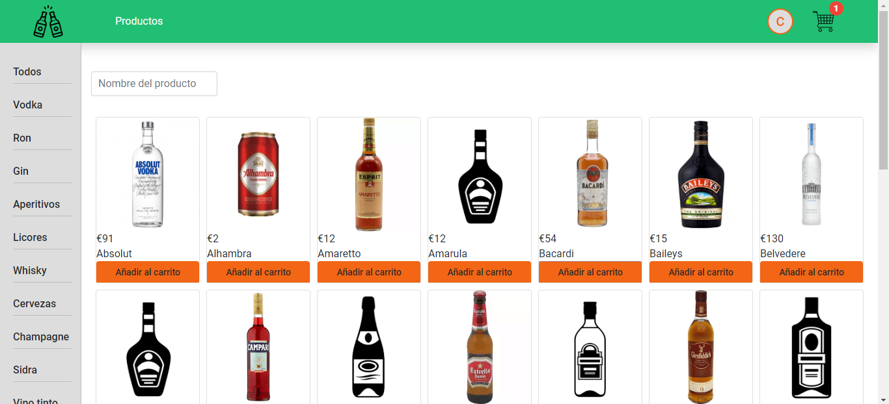
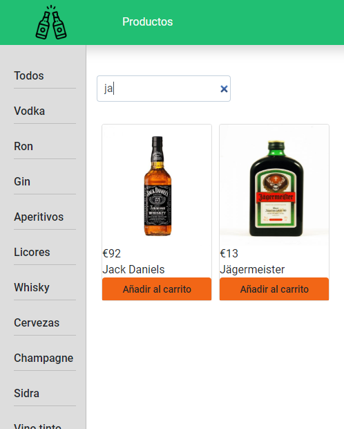
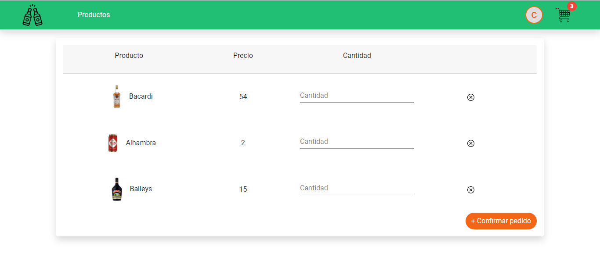
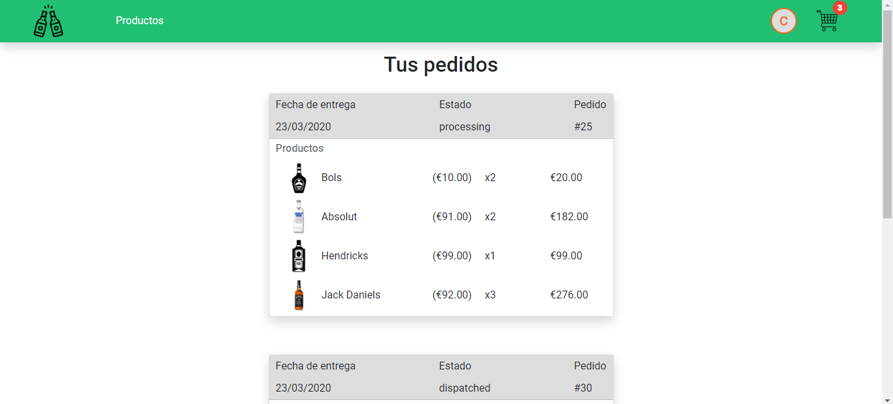

# Chin-Chin

This was my fourth coding Bootcamp project: a drink products e-commerce.

It was made with MySQL, ExpressJS, Angular, NodeJS & Bootstrap.

## Views

### Login / Registration

### Admin side

View all products and you can insert, update or delete them.

Insert new product

Filter by category name

 

### Customer side

View all products and you can add them to the cart.

Filter by product name

Customer cart

 

Customer orders

 

You can see the demo here: https://youtu.be/M8NRgWPopvs

Made by [Jennifer Goijman](https://github.com/JenniferGoijman)
